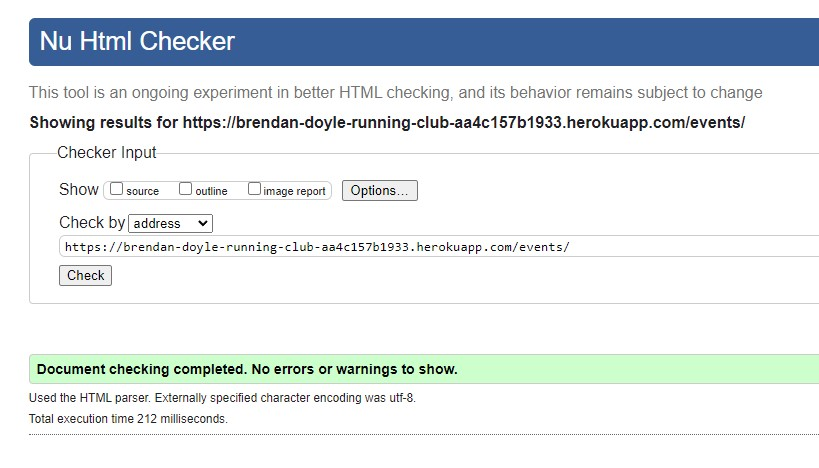
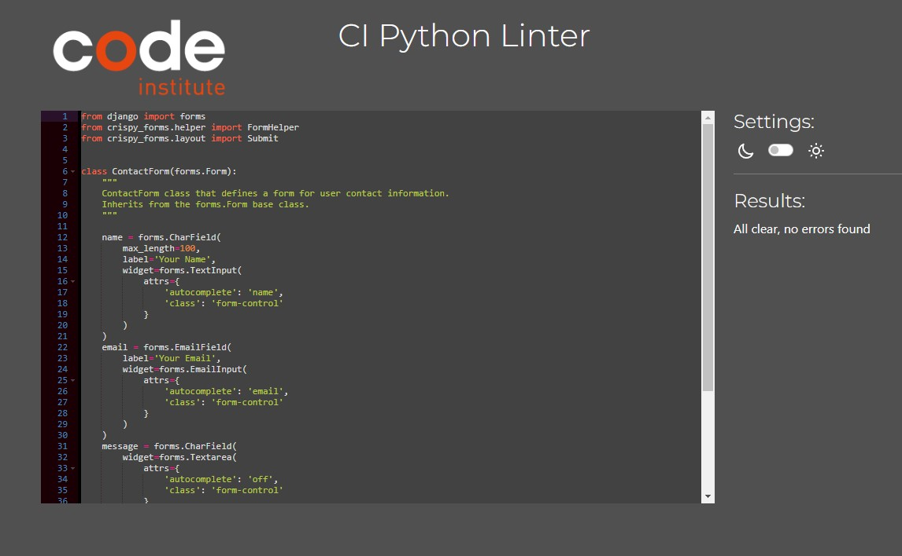

# Brendan Doyle Running Club


## Introduction

  - Welcome to the Brendan Doyle Running Club. I have designed this website for my local running club in Co. Longford, Ireland. The website provides information regarding classes, locations, events, and a contact page. The website also provides a members area where approved members can securely access downloadable training routes (.gpx), as well as upload their own favorite routes to share amongst the members.
  - This is my fourth project on the Full-Stack Developer course with the Code Institute, and focuses on Django frameworks, Bootstrap, Database Managment, Agile Methodologies, and CRUD functionality.

  [Click here to visit Brendan Doyle Running Club](https://brendan-doyle-running-club-aa4c157b1933.herokuapp.com/)


  [Admin access](https://brendan-doyle-running-club-aa4c157b1933.herokuapp.com/admin/login/?next=/admin/)

---

## Table of Contents

1. [Introduction](#introduction)
2. [UX - User Experience](#ux---user-experience)
    - [Design Inspiration](#design-inspiration)
    - [Color Choices](#color-choices)
    - [Font Choices](#font-choices)
3. [Project Planning](#project-planning)
    - [Agile Methodologies - Project Management](#agile-methodologies---project-management)
    - [User Stories](#user-stories)
4. [Wireframes](#wireframes)
5. [Database Schema](#database-schema)
6. [Security](#security)
7. [Features](#features)
    - [User Views and Features - Non-members/Members](#user-views-and-features---non-membersmembers)
    - [CRUD Functionality](#crud-functionality)
    - [Feature Showcase](#feature-showcase)
    - [Future Features](#future-features)
8. [Technologies & Languages Used](#technologies--languages-used)
    - [Libraries, Frameworks & APIs](#libraries-frameworks--apis)
    - [Packages](#packages)
    - [Utilities](#utilities)
9. [Testing](#testing)
    - [Validation](#validation)
        - [Lighthouse Testing](#lighthouse-testing)
        - [Code Validation](#code-validation)
            - [HTML Code Validation](#html-code-validation)
            - [CSS Code Validation](#css-code-validation)
            - [Python Code Validation](#python-code-validation)
            - [Javascript Validation](#javascript-validation)
    - [Manual Testing](#manual-testing)
    - [Authentication Features](#authentication-features)
10. [Unit Testing](#unit-testing)
11. [Integration Testing](#integration-testing)
12. [User Acceptance Testing](#user-acceptance-testing)
13. [Deployment](#deployment)
    - [Create a New Github Repository from a Template](#create-a-new-github-repository-from-a-template)
    - [Open Repository on Gitpod](#open-repository-on-gitpod)
    - [Django Project Setup](#django-project-setup)
    - [Cloudinary API](#cloudinary-api)
    - [Postgres SQL](#postgres-sql)
    - [Heroku Deployment](#heroku-deployment)
14. [Bugs](#bugs)
15. [Credits](#credits)
    - [Code Inspiration](#code-inspiration)
    - [Media](#media)
    - [Acknowledgements](#acknowledgements)

---

## UX - User Experience

---

### Design Inspiration

The Brendan Doyle Running Club website was designed with a clear focus on providing all the essential information that a new visitor would want to see. The key elements include:

- **Comprehensive Club Information**: The website offers detailed insights into the club’s goals, class schedules, and locations, making it easy for newcomers to understand what the club is about and how to get involved.
- **Contact and Event Entry**: A user-friendly contact form is available for visitors to reach out with queries, and there’s also an option to register for the annual race event, which is open to the general public.
- **Exclusive Members Area**: To add value for club members, the site features a dedicated members area. Access to this area is restricted and requires approval. The highlight here is the ability to download GPX files, which are routes created by the club or saved by members during their runs. These files support CRUD functionality for the uploader and can be synced with popular platforms like Strava, Garmin, and Coros. This enables members to access detailed course information, including distance, elevation, and terrain, and follow the route in real-time on compatible devices.

---

## Color Choices

The design of the Brendan Doyle Running Club website features a modern and energetic aesthetic, with a color scheme centered around deep green (`#115a38`), off-white (`#f8f9fa`), and vibrant accents like yellow (`#ffff00`) and orange-red (`#FF5733`). The green syncronizes with nature, making it ideal for a running club, while the accent colors draw attention to key elements without overwhelming the design.

### Font Choices

The font choices are selected to balance readability with a modern feel:

- **Kanit** is the primary font, offering clean, structured text that’s easy to read across devices.
- **Anton** is used for bold headings, adding impact and strength to the design.

---

## Project Planning

### Agile Methodologies - Project Management

I used Agile methodologies to manage the development process effectively. By utilizing GitHub's project management tools, I created and tracked issues to break down tasks and stay organized. Milestones were used to group related tasks, helping to track progress toward key goals. This approach provided a clear roadmap, allowing for regular assessments and adjustments as needed. GitHub’s tools helped ensure that the project stayed on track and adaptable throughout the development process.

### User Stories
#### Visitor User Stories
- As a visitor I can easily view where and when the classes are being held so that I can see if they suits my location and schedule.

#### Epic - Members Area
- As a user I can register with the club so that I can access a members area that is not accessible by non-members, and subject to verification.
- As a member I can log into my account so that I can download gpx routes in the members area.

#### Epic - Members Profiles
- As a logged-in member I can view my personal profile so that I can view, edit & delete my account details.

#### Epic - Race Event Entry
- As a user I can view events so that I can book in for a race event.

#### Epic - Contact Us
- As a user I can contact the club so that I can have any further questions answered.

---

### Wireframes

   Wireframe for the Homepage

  
  
   Wireframe for the About Page

  
  
   Wireframe for the Classes Page

  
  
Wireframe for the Events Page

  
  
Wireframe for the Contact Page

  
  
Wireframe for the Login Page

  
  
Wireframe for the Signup Page

  
  
Wireframe for the Members Area

  
  

---

### Database Schema

**Database Schema Diagram**

  

### Database Schema and Relationships

The database schema for the Brendan Doyle Running Club project is designed to manage user authentication, user profiles, uploaded GPX files, and related administrative tasks. Below is an explanation of the key models and their relationships:

1. **User Model (`django.contrib.auth.models.User`)**:
   - The `User` model is central to the application and represents the users of the system.
   - It includes fields such as `username`, `email`, `password`, `first_name`, and `last_name`.
   - This model also interacts with several other models through relationships, such as one-to-one with the `Profile` model and one-to-many with the `GPXFile` model.

2. **Profile Model (`profiles.models.Profile`)**:
   - The `Profile` model extends the default `User` model with additional information.
   - Each `Profile` is linked to a single `User` through a one-to-one relationship, ensuring that each user has a unique profile.
   - This model is essential for storing user-specific data that doesn't fit into the basic `User` model.

3. **GPXFile Model (`members.models.GPXFile`)**:
   - The `GPXFile` model is used to store information about GPS tracks uploaded by users.
   - It includes fields for `title`, `file_data` (the actual GPS data), `uploaded_by` (the user who uploaded the file), and `uploaded_at` (the timestamp of the upload).
   - The `uploaded_by` field is a foreign key linking back to the `User` model, establishing a one-to-many relationship where one user can upload multiple GPX files.

4. **Django's Built-in Models**:
   - The schema also includes several built-in Django models like `Group`, `Permission`, `ContentType`, `Session`, and models from the `django.contrib.auth` and `django.contrib.admin` apps.
   - These models provide functionalities such as user permissions, session management, and content type information.
   - The `LogEntry` model is particularly used for tracking administrative actions within the Django admin interface.

5. **Allauth Models**:
   - Models like `EmailAddress`, `EmailConfirmation`, `SocialAccount`, `SocialApp`, and `SocialToken` are part of the Django Allauth package, which manages user authentication, including email verification and social account integration.
   - These models establish relationships with the `User` model, ensuring that email confirmations and social account data are properly linked to individual users.

6. **Permissions and Groups**:
   - The `Permission` and `Group` models work together to manage access control across the application.
   - Users can be assigned to groups, and these groups can have specific permissions that control access to different parts of the application.

### Relationship Summary

The diagram illustrates the relationships between these models:

- **One-to-One Relationship**: 
   - Between `User` and `Profile`.

- **One-to-Many Relationship**:
   - Between `User` and `GPXFile`.
   - Between `User` and several Allauth-related models like `EmailAddress`.

- **Many-to-Many Relationship**:
   - Between `User` and `Group`, allowing users to be part of multiple groups.

- **Foreign Key Relationships**:
   - Various foreign keys connect models such as `LogEntry`, `GPXFile`, and Allauth models back to the `User` model, ensuring that actions and uploads are properly attributed to individual users.

This schema effectively manages the complexity of user data, authentication, and uploaded content, ensuring that the Brendan Doyle Running Club application can serve its members effectively while maintaining robust security and data integrity.

---

## Security

### Overview

Ensuring the security of user data and the integrity of the application is a top priority. The following measures have been implemented to secure the Brendan Doyle Running Club website:

### 1. Environmental Variables

Sensitive information, such as API keys, database credentials, and secret keys, is stored in environment variables. This approach ensures that these details are not hard-coded into the codebase and are not exposed in the version control system (e.g., GitHub).

To manage environment variables, the project uses the `django-environ` package. Key configurations include:

- **SECRET_KEY**: This is the secret key used by Django for cryptographic signing. It is kept as an environment variable to prevent exposure.
- **DATABASE_URL**: Connection string for the PostgreSQL database.
- **CLOUDINARY_URL**: URL for Cloudinary API integration.
- **EMAIL_HOST_PASSWORD**: Password for the email service used by the application.
- **GOOGLE_MAPS_API_KEY**: API key for Google Maps integration.

These environment variables are loaded securely and used throughout the application, ensuring that sensitive data is protected.

### 2. Cross-Site Request Forgery (CSRF) Protection

To prevent Cross-Site Request Forgery (CSRF) attacks, Django provides built-in middleware. The following settings have been enabled to enhance CSRF protection:

- **CSRF_COOKIE_HTTPONLY = True**: This setting ensures that the CSRF cookie is only accessible via HTTP(S) requests, which means it cannot be accessed by client-side JavaScript. This adds a layer of security by preventing malicious scripts from hijacking the CSRF token.
  
- **CSRF_COOKIE_SECURE = True**: This setting ensures that the CSRF cookie is only sent over HTTPS, preventing it from being intercepted in transit. This is particularly important when the site is served over HTTPS, as it ensures that the token is not exposed over insecure connections.

### 3. Secure Cookies

In addition to securing the CSRF cookie, the following settings have been applied to secure the session cookies:

- **SESSION_COOKIE_SECURE = True**: Ensures that the session cookie is only sent over HTTPS, protecting it from being intercepted over insecure connections.

- **SESSION_COOKIE_HTTPONLY = True**: Prevents client-side scripts from accessing the session cookie, reducing the risk of XSS (Cross-Site Scripting) attacks.

### 4. Content Security Policy (CSP)

While Django does not enforce Content Security Policy (CSP) by default, implementing a CSP is recommended to prevent a wide range of attacks, including XSS. A CSP can be configured to restrict the sources from which content can be loaded.

### 5. HTTPS

The application is served over HTTPS, ensuring that all data transmitted between the client and server is encrypted. This helps protect against man-in-the-middle attacks.

### 6. User Authentication and Permissions

- **Django Allauth**: The application uses Django Allauth for robust user authentication, including email verification and social account integration.
- **Custom Permissions**: Certain views and functionalities are restricted to authenticated users. The members area, for example, is accessible only to verified members.


## Features

### User Views and Features - Non-members/Members
- Non-members can view info about the club, classes, times and locations.
- Non-members can visit the events page where they can view the annual club race, 
and also natiowide race events not related to the club.
- Non-members can send queries via the Contact page. 
- Members can view the club GPX files & upload their own routes.
- The members area is subject to admin verification. This ensures only club members 
can access the route information. This is an important safety feature. It is important 
that club members feel safe to use the uploaded routes.
- Members have access to running/fitness related podcasts via Spotify.

### CRUD Functionality
Detail the Create, Read, Update, and Delete functionalities implemented in the project.

### Feature Showcase
Highlight the main features of the project with descriptions and screenshots if available.

### Future Features
- Future features would include haldling the race event booking within the club website. 
This would involve a separate signup for race entrants. This feature would keep the race entrants
separate from verified club members. Non-member race entrants should not have access to member related features.
- I would include articles related to running, nutritional support, etc. I did not include this because of it being
too close to the blog walkthrough project.

## Technologies & Languages Used

- HTML
- CSS
- Python
- Javascript

### Libraries, Frameworks & APIs

- Django
- Bootstrap5
- Google Fonts
- Google Maps

### Packages

- Django Allauth
- Crispyforms
- Crispy Bootstrap5
- cloudinary
- Sendgrid
- Psycopg

### Utilities

- Git
- Github
- Heroku
- PostgreSQL
- Balsamiq Wireframes
- Google Chrome Dev Tools
- Favicon
- Perplexity AI
- ChatGPT-4o

## Testing

## Validation

### Lighthouse Testing

Lighthouse testing was carried out on the desktop and mobile views of the website

**Desktop View Score**


**Mobile View Score**


### Code Validation

### HTML Code Validation

Homepage Code Validation


About Page Code Validation


Classes Page Code Validation


Events Page Code Validation



Contact Page Code Validation


Login Page Code Validation


Signup Page Validation


### CSS Code Validation

The CSS code has been validated for compliance.


### Python Code Validation

### running_club App

The `urls.py` file in the running_club app has been validated for PEP8 compliance.


The `settings.py` file in the running_club app has been validated for PEP8 compliance.


### profiles App

The `views.py` file in the profiles app has been validated for PEP8 compliance.


The `signals.py` file in the profiles app has been validated for PEP8 compliance.


The `urls.py` file in the profiles app has been validated for PEP8 compliance.


The `models.py` file in the profiles app has been validated for PEP8 compliance.


The `forms.py` file in the profiles app has been validated for PEP8 compliance.


The `apps.py` file in the profiles app has been validated for PEP8 compliance.


The `admin.py` file in the profiles app has been validated for PEP8 compliance.


### Members App

The `views.py` file in the members app has been validated for PEP8 compliance.


The `signals.py` file in the members app has been validated for PEP8 compliance.


The `urls.py` file in the members app has been validated for PEP8 compliance.


The `models.py` file in the members app has been validated for PEP8 compliance.


The `middleware.py` file in the members app has been validated for PEP8 compliance.


The `forms.py` file in the members app has been validated for PEP8 compliance.


The `apps.py` file in the members app has been validated for PEP8 compliance.


The `admin.py` file in the members app has been validated for PEP8 compliance.


### Home App

The `urls.py` file in the home app has been validated for PEP8 compliance.


The `forms.py` file in the home app has been validated for PEP8 compliance.



The `apps.py` file in the home app has been validated for PEP8 compliance.


The `views.py` file in the home app has been validated for PEP8 compliance.


### Javascript Validation


### Manual Testing

Manual testing was conducted extensively to ensure the application's responsiveness and usability across different devices and browsers. This testing involved using various tools and techniques to verify that the application renders correctly on mobile devices, tablets, and desktops. 

Testing on physical devices included smartphones with different screen sizes and resolutions to check for any layout issues or touch interactions. Additionally, the application was tested on various browsers such as Chrome, Firefox, Safari, and Edge to ensure cross-browser compatibility and consistent user experience. 

Tools like Google Chrome DevTools were used to simulate different screen sizes and devices, allowing for quick checks of responsive design elements. The application's layout, typography, and interactive elements were adjusted based on feedback from these tests to ensure a seamless experience across all platforms. 

Overall, this rigorous manual testing process ensured that the application is fully responsive, accessible, and performs optimally on a wide range of devices and browsers.

### Authentication Features

To ensure the authentication features of the Brendan Doyle Running Club website are functioning correctly, I performed thorough manual testing on the following key areas:

### Signup Page

- **Signup Page**: Verified that new users can register successfully by filling in all required fields. Tested form validations to ensure errors are correctly displayed when invalid data is entered (e.g., weak passwords, mismatched passwords).

Sign Up Page


Sign Up Required Fields


Sign Up Username Requirement


### Login Page

- **Login Page**: Confirmed that registered users can log in with valid credentials and that appropriate error messages are shown when incorrect details are entered.

Login Form View


Login Incorrect Details Warning


### Password Reset Request

- **Password Reset Request**: Checked the functionality of the "Forgot Password" link by requesting a password reset. Ensured that users receive a password reset email and that the link directs them to the correct reset page.

Forgotten Password Reset Form


Password Reset Link Sent by Email


Set New Password Form


Password Successfully Reset Notification


Through these tests, I ensured that the authentication mechanisms user-friendly and secure, providing a smooth experience for users interacting with the login, signup, and password reset features.

---

### Unit Testing
Explain the unit testing methodologies used to ensure individual components function correctly.

### Integration Testing
Describe the integration testing processes to ensure different components work together as expected.

### User Acceptance Testing
Detail the user acceptance testing to validate the project meets user requirements.

---

## Deployment

### Create a New Github Repository from a Template

To begin your project deployment, follow these steps to create a new GitHub repository from a template:

1. **Navigate to the Template Repository**:
   - Visit the [Code Institute template repository](https://github.com/Code-Institute-Org/ci-full-template).

2. **Create a New Repository**:
   - Click on the green button labeled "Use this template" located near the top right of the page.
   - Select "Create a new repository" from the dropdown options.
   - Enter a name for your new repository.
   - Add a description for your repository.
   - Set the privacy to **Public**.
   - Click on the "Create repository from template" button to finalize.

### Open Repository on Gitpod

To begin working on your repository in Gitpod, follow these steps:

1. **Log in to GitHub**:
   - Ensure you are logged into your GitHub account.

2. **Navigate to Your Repository**:
   - Find your repository by using the GitHub search bar or by navigating directly to it.

3. **Open in Gitpod**:
   - Once inside the repository, open it in Gitpod. This will initialize a workspace and clone the repository into it.

4. **Start Working**:
   - You can now start working on your project within the Gitpod online IDE.
   - Once changes are made, you can commit and push them back to GitHub using the integrated terminal or source control tools provided by Gitpod.

### Django Project Setup

To set up your Django project, follow these steps:

1. **Install Django**:
   - Since Python is included with the template, install Django directly using:
     ```bash
     pip install django
     ```

2. **Create a Project Structure**:
   - Generate the directory structure for your project:
     ```bash
     django-admin startproject <project_name>
     ```

3. **Run Initial Migration**:
   - Set up the built-in database by running:
     ```bash
     python manage.py migrate
     ```

4. **Create a Superuser**:
   - To access the Django admin interface, create a superuser:
     ```bash
     python manage.py createsuperuser
     ```

5. **Start the Development Server**:
   - Start the Django development server to see your project in action:
     ```bash
     python manage.py runserver
     ```
   - Open a web browser and navigate to `http://127.0.0.1:8000/` to see the Django welcome page.

6. **Access the Django Admin Interface**:
   - Navigate to `http://127.0.0.1:8000/admin/` to access the Django admin interface.

### Cloudinary API

To set up Cloudinary for media storage, follow these steps:

1. **Install the Cloudinary SDK**:
   - Install the Cloudinary Python SDK and Django integration package:
     ```bash
     pip install cloudinary django-cloudinary-storage
     ```

2. **Configure Cloudinary Credentials**:
   - Configure your Cloudinary credentials in `settings.py` using environment variables. First, install Django-environ:
     ```bash
     pip install django-environ
     ```

### Postgres SQL

For database management, this project utilizes Postgres SQL:

- The Code Institute provided a Postgres database for this project.
- Environment variables were used to securely manage and store database details, ensuring they are not exposed in the repository.

### Heroku Deployment

To deploy your Django project on Heroku, follow these steps:

1. **Install Required Packages**:
   - Install `gunicorn` (WSGI HTTP Server for Python), `whitenoise` (to serve static files), and `psycopg2` (PostgreSQL database adapter for Python).

2. **Create a Heroku App**:
   - Log in to Heroku and navigate to **Create New App**.
   - Enter your app name and click on **Create App**.

3. **Set Config Vars**:
   - In the **Deploy** section, navigate to **Config Vars** and reveal them.
   - Enter the necessary configuration values. For this project, they were `SECRET_KEY`, `DATABASE_URL`, `CLOUDINARY_URL`, `DEFAULT_FROM_EMAIL`, `GOOGLE_MAPS_API_KEY`, and `RUNNING_CLUB_MAIL`. Additionally, `PORT:8000` and `DISABLE_COLLECTSTATIC` (with a value of 1) were added during deployment.

4. **Configure ALLOWED_HOSTS**:
   - Add the Heroku host name to the `ALLOWED_HOSTS` in `settings.py`.

5. **Deploy the Project**:
   - In the **Deploy** tab, select GitHub as the method of deployment, connect your repository, and manually deploy the branch.

6. **Finalize Deployment**:
   - Ensure `DEBUG` is set to `False` in your settings before final deployment.
   - After a successful deployment, `DISABLE_COLLECTSTATIC` and `PORT:8000` can be removed from the Config Vars.

---

## Bugs

**Existing Bugs**
- A known issue exists with the rendering of Google Maps on the Classes page. After thorough investigation, it was determined that this problem is not due to an error in the code but is related to an internal issue with the Google Maps API. Despite attempting to use previous versions, I was advised to stick with the most recent version. I also explored alternative map APIs, but none matched the professional appearance and functionality of Google Maps. To mitigate this issue, I implemented a JavaScript prompt encouraging users to refresh the page if the map view does not load.


**Other Bugs**

1. **Duplicate JavaScript Files from Admin-Interface Installation**  
   During the installation of the `django-admin-interface` package, I encountered duplicate JavaScript files, which led to unexpected behaviors in the admin panel. This required careful file management to remove duplicates and ensure only the necessary scripts were loaded.

2. **Styles Not Connecting to Login/Signup Pages**  
   I faced issues where the styles were not properly connecting to the login and signup pages. The root cause was a misnamed directory; I had renamed the default `account` directory to `accounts` in an attempt to improve syntax. This also required reverting changes in `urls.py` to restore proper functionality.

3. **Static Files Issues with .gitignore**  
   While working on static files, I accidentally added critical files to `.gitignore`, which caused them to be excluded from commits. This mistake led to untidy and incomplete commits. After reverting these changes, I had to clean up the commit history to maintain a professional repository.

4. **Heroku Deployment Forms Bug**  
   A bug arose during Heroku deployment where forms were not rendering correctly. Clearing the cache resolved this issue. A special thanks to Kamil for the guidance on this matter!

5. **Stylesheet Not Connecting Due to Missing collectstatic**  
   I encountered an issue where stylesheet changes were not reflected after deployment. This was due to not running `collectstatic` to gather the latest CSS changes. Running this command resolved the issue.

6. **Stylesheet Changes Not Appearing on Refresh**  
   At one point, stylesheet changes were not appearing even after refreshing the page. The solution was setting `DEBUG = True`, which allowed the changes to be reloaded correctly.

7. **Meta Blocking VPN Access to Threads in EU**  
   During development, Meta's restrictions blocked VPN access to Threads in the EU, which impacted testing and deployment workflows involving social media integrations. I did not include Threads in the social media links.

8. **Log Out of Admin Account When Testing Locally**  
   A lesson learned was to always log out of the admin account when testing on localhost. Remaining logged in as an admin affected the behavior of allauth forms, leading to misleading results. The fix for this to log in using a different browser./

9. **Server Error 500 on New Account Creation**  
   Users encountered a server error (500) when attempting to create a new account. This required debugging to identify issues within the account creation logic and ensure smooth user onboarding.

10. **Race Booking Event Model**  
   Initially, I wanted to implement a separate login setup for race entrants who are not club members to prevent them from accessing the members' area. This required setting up a completely different account system. However, due to time constraints and project requirements, I decided to abandon this model. In practice, the club uses an external service provider for event registration and payment, which alleviates the need for this feature.

---

## Credits

### Code Inspiration

**During this project I relied on the following YouTube videod for guidance with my issues:**

- [Python Django application walkthrough tutorial for Google maps](https://www.youtube.com/watch?v=wCn8WND-JpU&t=8s)
- [Style Django Forms With Bootstrap - Django Blog #5](https://www.youtube.com/watch?v=6-XXvUENY_8)
- [How To Use Django Crispy Forms](https://www.youtube.com/watch?v=HX1mErYy8hU)
- [E 030 Django E commerce Toasts Part 1](https://www.youtube.com/watch?v=cwhROnUBZbQ)
- [How To Modify and Override Django Allauth Template Page](https://www.youtube.com/watch?v=VIoKemDBv8Y&t=3s)
- [Password Reset Email Using SendGrid SMTP | Django](https://www.youtube.com/watch?v=xyUIhluXF_Y)
- [Sending emails using Sendgrid with Python](https://www.youtube.com/watch?v=PU-K34Ar1sY)

**I also used the following websites for guidance:**
- [Stack Overflow](https://stackoverflow.com/)
- [Django documentation](https://docs.djangoproject.com/en/5.1/)
- [OpenAI's ChatGPT](https://chatgpt.com/)
- [Perplexity](https://www.perplexity.ai/)

### Media

Photo credits go to Adrian Wrobel, Brendan Doyle, and Madeline Doyle.

### Acknowledgements

I would like to extend my gratitude to:

- My Cohort Facilitator Kamil, as well as Amy and Paul.
- My mentor, Rohit.
- Tutor Support for their assistance throughout the project.
- Brendan Doyle Running, for granting permission to design their club website.
- My Wife, for putting up with the stress and late nights, pretending to listen to me constantly ramble on about things I barely understand myself, basically for her 100% support through the course so far. 
- Everybody who tested my project at different stages of production, gave feedback, encouragement, and helped in any way.

--- 
